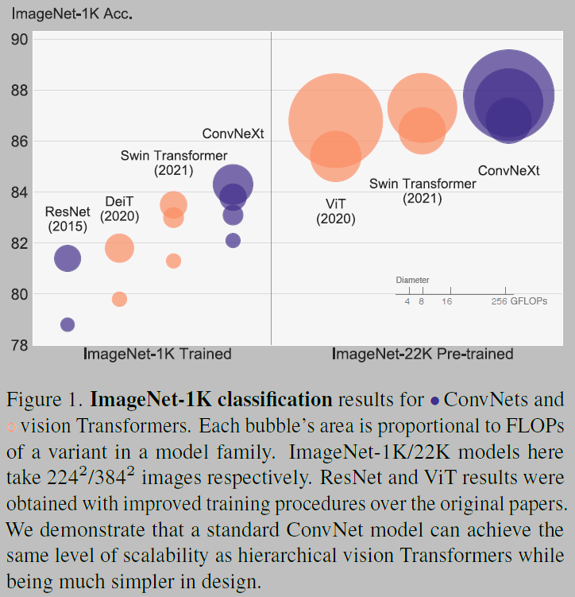
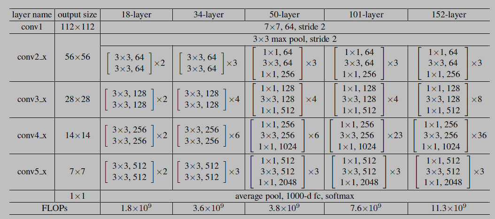
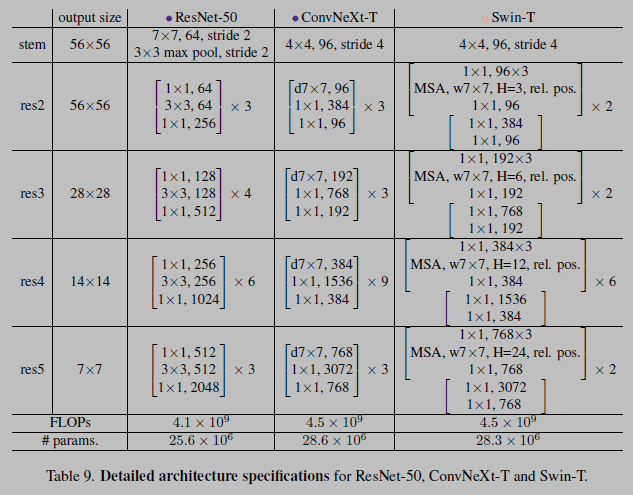
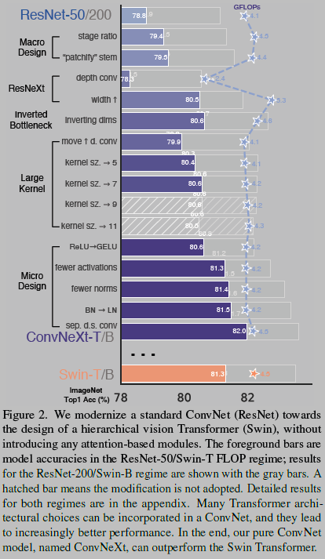
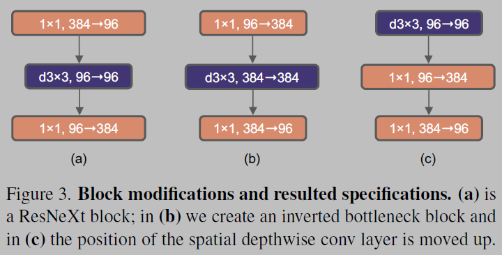
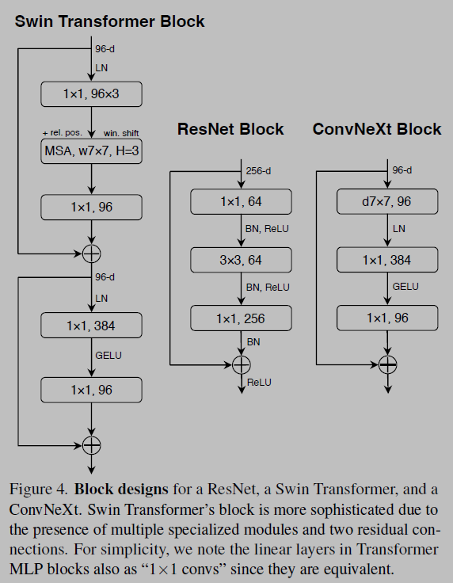

# ConvNeXt
* This repo contains a brief summary of the paper 'A ConvNet for the 2020s'
* I've finetuned a pre-trained model from keras on a [dog-classification dataset from Kaggle](https://www.kaggle.com/competitions/dog-breed-identification)
* I'll be implementing the paper soon

# A ConvNet for the 2020s [[Paper]](https://arxiv.org/pdf/2201.03545.pdf)
* 

## ResNet Architecture
* Architectures for ImageNet. Building blocks are shown in brackets, with the number of blocks stacked. Downsampling is performed by `conv3_1`, `conv4_1`, and `conv5_1` with a stride of 2

## ConvNeXT Architecture
* 

## Abstract
* The introduction of Vision Transformers (ViTs), which quickly superseded ConvNets as the state-of-the-art image classification model
* A vanilla ViT, on the other hand, faces difficulties when applied to general computer vision tasks such as object detection and semantic segmentation
* It is the hierarchical Transformers (e.g., Swin Transformers) that reintroduced several ConvNet priors, making Transformers practically viable as a generic vision backbone and demonstrating remarkable performance on a wide variety of vision tasks
* Now, they reexamine the design spaces and test the limits of what a pure ConvNet can achieve

## Introduction
* ConvNets have several built-in inductive biases that make them well-suited
to a wide variety of computer vision applications
* The most important one is translation equivariance, which is a desirable property for tasks like objection detection
* ConvNets are also inherently efficient due to the fact that when used in a sliding-window manner, the computations are shared
---
* Except for the initial “patchify” layer, which splits an image into a sequence of patches, ViT introduces no image-specific inductive bias and makes minimal changes to the original NLP Transformers
* One primary focus of ViT is on the scaling behaviour: with the help of larger model and dataset sizes, Transformers can outperform standard ResNets by a significant margin
* Hierarchical Transformers employ a hybrid approach to bridge this gap. For example, the “sliding window” strategy (e.g. attention within local windows) was reintroduced to Transformers, allowing them to behave more similarly to
ConvNets
* Swin Transformer’s success and rapid adoption also revealed one thing: the essence of convolution is not becoming irrelevant; rather, it remains much desired and has never faded
* The only reason ConvNets appear to be losing steam is that ( hierarchical ) transformers surpass them in many vision tasks, and the performance difference is usually attributed to the superior scaling behaviour of Transformers, with multi-head self-attention being the key component

## Modernizing a ConvNet: a Roadmap
* 
* They modernize a standard ConvNet (ResNet) towards the design of a hierarchical vision Transformer (Swin), without introducing any attention-based modules
* Many Transformer architectural choices can be incorporated into a ConvNet, and they lead to increasingly better performance. In the end, our pure ConvNet
model, named ConvNeXt, can outperform the Swin Transformer

# Our starting point is a ResNet-50 model:
* Baseline: Train it with similar training techniques used to train vision Transformers and obtain much improved results compared to the original ResNet-50
* Design decisions: (1) macro design, (2) ResNeXt, (3) inverted bottleneck, (4)
large kernel size, and (5) various layer-wise micro designs

# Training Techniques
* Vision Transformers bring a new set of modules and architectural design decisions, but they also introduced different training techniques
* Num_epochs: 90 -> 300
* They use the AdamW optimizer, data augmentation techniques such as Mixup, Cutmix, RandAugment, Random Erasing, and regularization schemes including Stochastic Depth and Label Smoothing
* Accuracy Changes in ResNet-50: 76.1% to 78.8%, implying that a significant portion of the performance difference between traditional ConvNets and vision Transformers may be due to the training techniques

# Macro Design
## Changing stage ratio
* Following the design, They adjust the number of blocks in each stage from **(3, 4, 6, 3) in ResNet-50 to (3, 3, 9, 3)**
* Accuracy Changes: **78.8% to 79.4%**

## Stem -> "Patchify"
* **The stem cell in standard ResNet contains a 7*7 convolution layer with stride 2, followed by a max pool, which results in a 4x downsampling of the input images**
* In vision Transformers, a more aggressive “patchify” strategy is used as the stem cell, which corresponds to a large kernel size (e.g. kernel size = 14 or 16) and non-overlapping convolution
* Swin Transformer uses a similar “patchify” layer, but with a smaller patch size of 4 to accommodate the architecture’s multi-stage design
* **They replace the ResNet-style stem cell with a patchify layer implemented using a 4*4, stride 4 convolutional layer. The accuracy has changed from 79.4% to 79.5%**

# ResNeXt-ify
* The core component is grouped convolution, where the convolutional filters are separated into different groups. At a high level, ResNeXt’s guiding principle is to “use more groups, expand width”
* They increase the network width to the same number of channels as Swin-T’s (from 64 to 96). This brings the network performance to 80.5% with increased FLOPs (5.3G).

# Inverted bottleneck
* One important design in every Transformer block is that it creates an inverted bottleneck, i.e., the hidden dimension of the MLP block is four times wider than the input dimension
* Results in slightly improved performance (80.5% to 80.6%). In the ResNet-200 / Swin-B regime, this step brings even more gain (81.9% to 82.6%) also with reduced FLOPs

# Large Kernel of Sizes
* One of the most distinguishing aspects of vision Transformers is their non-local self-attention, which enables each layer to have a global receptive field
## Moving up depthwise conv layer
* To explore large kernels, one prerequisite is to move up the position of the depthwise conv layer (Figure 3 (b) to (c))

* This is a natural design choice — the complex/inefficient modules (MSA, large-kernel conv) will have fewer channels, while the efficient, dense 1*1 layers will do the heavy lifting
* Temporary performance degradation to 79.9%
* They experimented with several kernel sizes, including 3, 5, 7, 9, and 11. The network’s performance increases from 79.9% (3*3) to 80.6% (7*7), while the network’s FLOPs stay roughly the same. Additionally, They observe that the benefit of larger kernel sizes reaches a saturation point at 7*7

# Micro Design
* ReLU can be substituted with GELU in our ConvNet too, although the accuracy stays unchanged (80.6%)

## Fewer activation functions
* One minor distinction between a Transformer and a ResNet block is that Transformers have fewer activation functions
* There is only one activation function present in the MLP block. In comparison, it is common practice to append an activation function to each convolutional layer, including the 1*1 convs. Here they examine how performance changes when they stick to the same strategy
* They eliminate all GELU layers from the residual block except for one between two 1*1 layers
* This process improves the result by 0.7% to 81.3%

## Fewer normalization layers
* Transformer blocks usually have fewer normalization layers as well, here they remove two BatchNorm (BN) layers, leaving only one BN layer before the conv 1*1 layers. This further boosts the performance to 81.4%

* They observe that our ConvNet model does not have any difficulties training with LN; in fact, the performance is slightly better, obtaining an accuracy of 81.5%.

## Separate downsampling layers
* In Swin Transformers, a separate downsampling layer is added between stages. they explore a similar strategy in which they use 2*2 conv layers with stride 2 for spatial downsampling
* This modification surprisingly leads to diverged training. Further investigation shows that adding normalization layers wherever spatial resolution is changed can help stabilise training
* These include several LN layers also used in Swin Transformers: one before each downsampling layer, one after the stem, and one after the final global average pooling

# Train Details
## Training on ImageNet-1K
* They train ConvNeXts for 300 epochs using AdamW with a learning rate of 4e-3. There is a 20-epoch linear warmup and a cosine decaying schedule afterwards. they use a batch size of 4096 and a weight decay of 0.05
## Pre-training on ImageNet-22K
* They pre-train ConvNeXts on ImageNet-22K for 90 epochs with a warmup of 5 epochs. they do not use EMA. Other settings follow ImageNet-1K.
## Fine-tuning on ImageNet-1K
* They fine-tune ImageNet-22K pre-trained models on ImageNet-1K for 30 epochs
* They use AdamW, a learning rate of 5e-5, cosine learning rate schedule, layer-wise learning rate decay, no warmup, a batch size of 512, and weight decay of 1e-8

